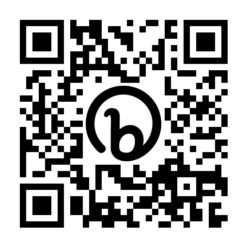

# 👋 Willkommen 👋

**C# Grundlagen**

## Ablauf 👩‍💻👨‍💻

Schulungsdauer: 4 Tage

Zeit: 8 - 16 Uhr

Mittagspause: 12 - 13 Uhr

## Vorstellung ✋

Wer bist du?

Deine Aufgaben im Unternehmen?

Hast du Erfahrungen im Umgang mit C#?

Was erwartest du von dieser Schulung?

## Ressourcen 📝

https://bit.ly/3RKfm9S
