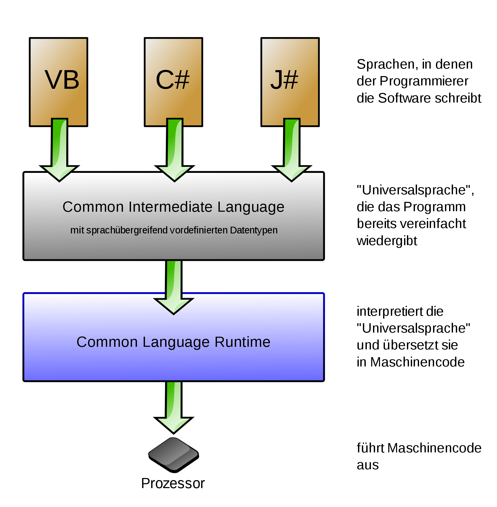
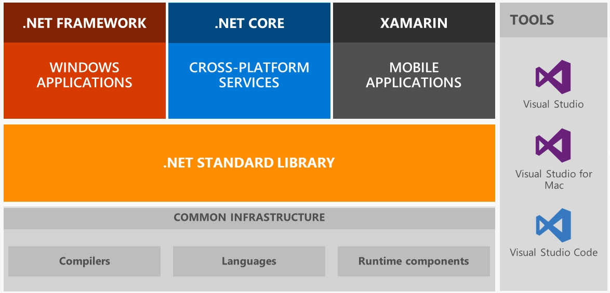
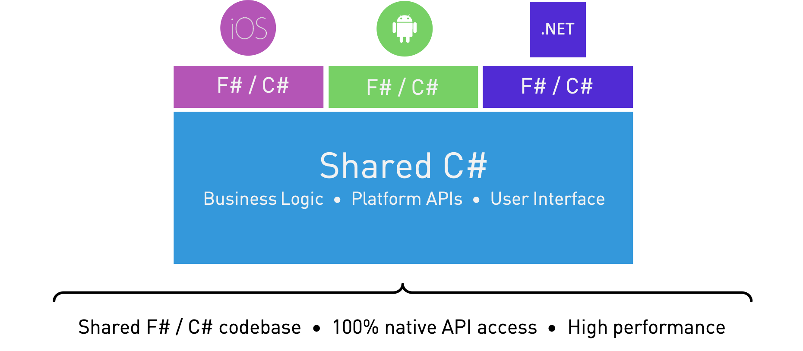

#  Das Framework & C#

Properietäres Framework von Microsoft zur Entwicklung von Windows Anwendungen.

.NET Framework ist ein Monolith.

Die erste Version wurde (.NET Framework 1.0) wurde 2000 vorgestellt.

Es ermöglichte die Entwicklung von Desktop & Webanwendungen.

2019 wurde die letzte Version (.NET Framework 4.8) veröffentlicht.

## Common Language Runtime

## .NET (Core)

.NET Core wurde 2016 veröffentlicht

Es ist OpenSource & Plattformunabhängig und kann auf Windows, Linux und macOS ausgeführt werden.

Ab 2020 entfällt der Zusatz **Core**

## .NET Standard

.NET Standard ist eine Mitte 2016 eingeführte Spezifikation für eine Funktionsumfang der .NET-Klassenbibliothek, die von verschiedenen .NET-Varianten implementiert werden kann.

Es erlaubt die Verwendung von Klassenbibliothek sowohl in .NET Core als auch in .NET Framework Anwendungen.

## .NET - Der Aufbau

## .NET - Die Sprachen

.NET unterstüzt die folgenden Programmiersprachen:

* C#
* VB.NET
* F#
* C++ (Windows)

## C#

Standartisierte Sprache bei der ECMA

Objekt-orientierte & typsichere Sprache

Entwurfen von Anders Hejlsberg für Microsoft

Die Sprache ist plattformunabhängig

## Xamarin

Xamarin ist eine Plattform zur Entwicklung von mobilen Anwendungen für iOS, Android und Windows.

## Blazor

Open-Source Webframework, welches auf .NET basiert und die Entwicklung mit C# und HTML erlaubt.

### Implementierungen

- **Blazor Server** Server Side Rendering von Razor Pages
- **Blazor WebAssembly** Single Page Application (SPA) in WebAssembly
- **Blazor PWA** Progressive Web App
- **Blazor Native** plattformnatives Framework, das eine plattformnative Benutzeroberfläche rendert