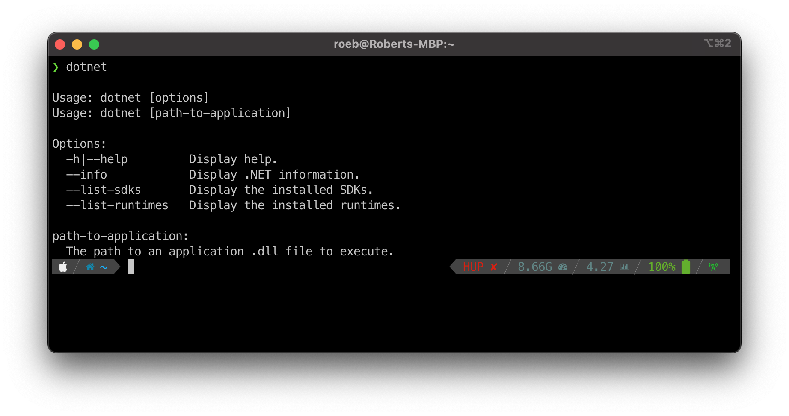
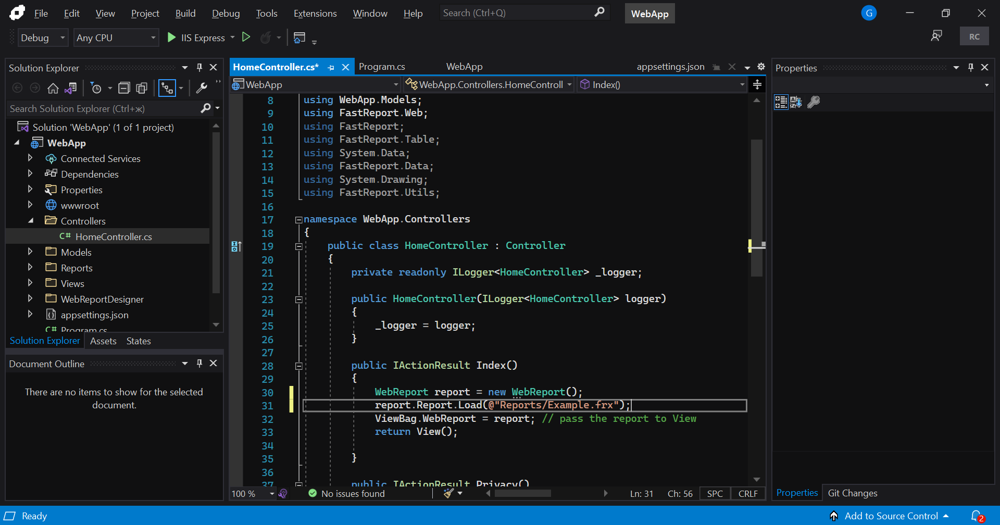
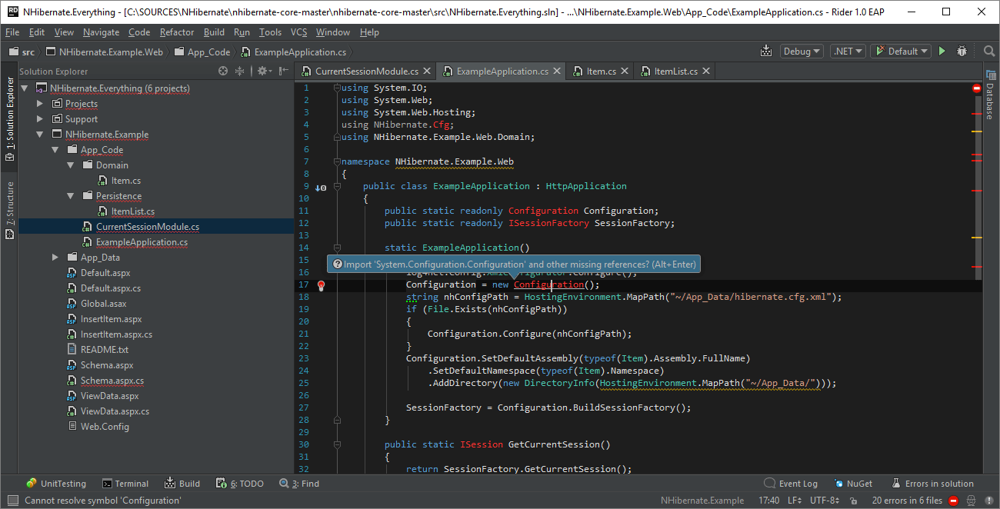

# Die Werkzeuge

## Runtime

Die **Runtime** ist in der Lage, die Anwendung zu starten und zu stoppen, sowie die Anwendung mit den Framework Bibliotheken zu verbinden.

## SDK

**S**oftware **D**evelopment **K**it, enthält Werkzeuge, Bibliotheken und Hilfsmittel um Software zu entwickeln.

<!-- .slide: class="two-floating-elements" -->
## Die CLI

* Ist ist eine plattformübergreifende Toolkette zum Entwicklung, Erstellen, Ausführen und Veröffentlichen von .NET-Anwendungen.

* Das SDK enthält die dotnet CLI.

## Die IDE

💡 IDE = integrierte Entwicklungsumgebung 💡

> Eine **IDE** ist eine Software für die Anwendungsentwicklung, die gängige Entwicklertools in einer zentralen grafischen Oberfläche vereint.

## NuGet

**NuGet** ist ein Paketmanager für .NET. Er ermöglicht das Verwalten von Bibliotheken und Abhängigkeiten.

Ein NuGet-Paket ist eine einzelne ZIP-Datei mit der Erweiterung .nupkg, die kompilierten Code (DLLs), andere Dateien im Zusammenhang mit diesem Code und ein beschreibendes Manifest enthält.

NuGets können von der öffentlichen NuGet Gallery oder von einem privaten NuGet-Feed heruntergeladen werden.

## NuGet - Der Flow

## Visual Studio Code

## Visual Studio 2022

## JetBrains Rider

