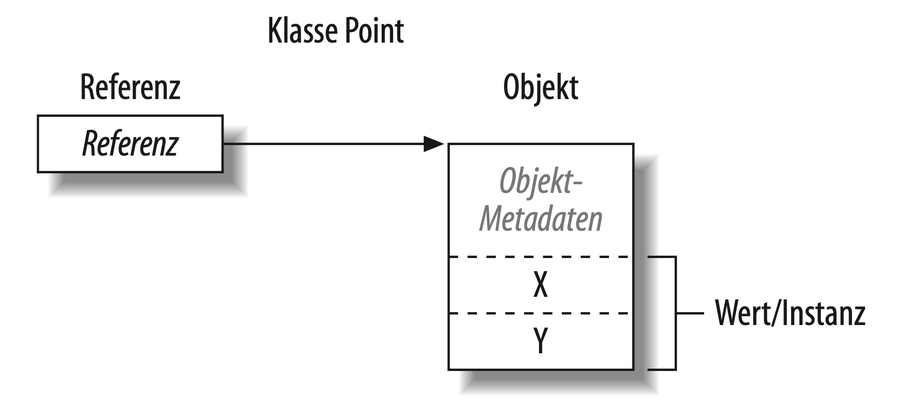

# Typgrundlagen


Ein Typ definiert die Blaupause für einen Wert.


## Der Code 

```csharp
using System;

int x = 12 * 30; 
Console.WriteLine (x);
```


## Variable & Konstante - In a nutshell

Eine **Variable** zeigt einen Speicherort an, der mit der Zeit unterschiedliche Werte annehmen kann.

Eine **Konstante** ist ein Wert, der sich nicht ändern kann.

Eine **Konstante** und **Variable** ist während der Laufzeit des Programms verfügbar.


## Vordefinierte Typen

Vordefinierte Typen, sind solche, die besonders vom Compiler unterstützt werden.

In C# sind vordefinierte Typen z.B.: `int`, `double`, `string`, `bool`.


## Vordefinierte Typen - Beispiel

```csharp
string message = "Hallo Welt";
string upperMessage = message.ToUpper(); 
Console.WriteLine(upperMessage);

int x = 2022;
message = message + x.ToString();
Console.WriteLine(message);
```


## Benutzerdefinierte Typen

Benutzerdefinierte Typen können mit Hilfe von Klassen und Strukturen definiert werden. 

.NET hat eine Sammlung von benutzerdefinierter Typen (z.B. DateTime).


## 👨‍🏫 Demo

Wir erstellen und benutzen einen benutzerdefinierten Typ.


## Member eines Typs

Ein Typ enthält **Daten-Member** und **Funktions-Member**

In unserem Beispiel ist **ratio** ein Daten-Member und **Convert** bzw. der **Konstruktor** ein Funktions-Member.


## Konstruktoren und Instanziierung

Daten werden erstellt, indem ein Typ instanziiert wird.

Bei vordefinierten Typen können einfach mit einem **Literal** definiert werden:

```csharp
int x = 12;
```

Der **new**-Operator erstellt Instanzen von benutzerdefinierten Typen.

Unmittelbar nachdem der **new**-Operator ein Objekt instanziiert hat, wird der **Konstruktor** des Objekts aufgerufen, um die Initialisierung durchzuführen


## Instanz-Member

Die Member (Daten und Funktion), die mit der Instanz des Typs arbeiten, werden als **Instanz-Member** bezeichnet.

Die Methode `Convert` von UnitConverter und die Methode `ToString` von int sind Beispiele für solche Instanz-Member.


## Statische Member

Member, die nicht mit der Instanz des Typs arbeiten, können als `static` gekennzeichnet werden.

Ein Beispiel ist die Methode `WriteLine` der Klasse Console.

```csharp
Console.WriteLine("Hallo Welt");
```


## 👨‍🏫 Demo

Wir erstellen statische Member und arbeiten damit.


## public und namespace

Das Schlüsselwort **public** macht Member für andere Klassen zugänglich.

Insbesondere bei größeren Programmen ist es sinnvoll, Typen in Namensräumen zu organisieren.

```csharp
namespace Animals {
    public class Panda {
        // ... 
    }
}
```


## Typen und Umwandlungen

C# kann Instanzen kompatibler Typen umwandeln.

Umwandlungen können **implizit** oder **explizit** sein.

Implizite Umwandlungen erfolgen automatisch, während explizite Umwandlungen einen Cast erfordern.

```csharp
int x = 12345; // int ist ein 32-Bit-Integer
long y = x; // implizite Umwandlung in einen 64-Bit-int 
short z = (short)x; // explizite Umwandlung in einen 16-Bit-int
```


## Werttypen vs. Referenztypen

**Werttypen** enthalten die meisten eingebauten Typen, aber auch selbst definierte struct- und enum-Typen.

**Referenztypen** enthalten alle Klassen-, Array-, Delegate- und Interface-Typen.

Der prinzipielle Unterschied zwischen Werttypen und Referenztypen ist ihre Behandlung im Arbeitsspeicher.


<!-- .slide: class="two-floating-elements" -->
## Werttypen

* Der Inhalt einer Werttyp-Variablen oder -Konstanten ist einfach ein Wert.
* Selbst definierten Werttyp können mithilfe des Schlüsselworts `struct` definiert werden.
* ```csharp
  struct Point {
      public int x;
      public int y;
  }
  ```
* Das Zuweisen einer Werttyp-Instanz **kopiert** immer die Instanz:


## Referenztypen

Besteht aus zwei Teilen: einem **Objekt** und der **Referenz** auf dieses Objekt.

```csharp
public class Point { public int X, Y; }
```




## Referenztypen

Durch das Zuweisen einer Referenztyp-Variablen wird die Referenz kopiert, nicht die Objektinstanz

Damit ist es möglich, mit mehreren Variablen auf dasselbe Objekt zu verweisen.


## 👨‍🏫 Demo

Werttypen und Referenztypen im Vergleich


## Null

Einer Referenz kann das Literal **null** zugewiesen werden, wodurch ausgesagt wird, dass die Referenz auf kein Objekt zeigt.

```csharp
Point p = null;
Console.WriteLine(p == null); // True
```

Der Versuch, auf ein Member einer Null-Referenz zuzugreifen, führt zu einem Laufzeitfehler:

```csharp
Console.WriteLine(p.X); // NullReferenceException
```

Standardmäßig kann einem **Werttyp** kein **null** zugewiesen werden.


## Vordefinierte Typen


### Werttypen

* Numerisch
    * Ganzzahl mit Vorzeichen (sbyte, short, int, long)
    * Ganzzahl ohne Vorzeichen (byte,ushort,uint,ulong)
    * Reelle Zahl (float,double,decimal)
* Logisch (bool)
* Zeichen (char)


### Referenztypen

* String (string) 
* Objekt (object)


## Numerische Suffixe

Die **numerischen Suffixe** definieren den Typ eines Literals:

```csharp
decimal d = 3.5M; // M = decimal
long i = 5; // implizite Umwandlung von int in long
float f = 4.5F; // kompiliert ohne Suffix nicht
decimal d = 4.5M; // kompiliert ohne Suffix nicht
```


## Arithmetische Operatoren

Die arithmetischen Operatoren (+, -, *, /, %) sind für alle numerischen Typen definiert. Der %-Operator wird zum Rest nach der Division ausgewertet.


## Inkrement- und Dekrementoperatoren

Die Inkrement- und Dekrementoperatoren (++, -–) erhöhen bzw. verringern numerische Typen um eins. 

Der Operator kann vor oder hinter der Variablen stehen.

```csharp
int x = 0; 
Console.WriteLine(x++); // Ausgabe 0; x ist jetzt 1
Console.WriteLine(++x); // Ausgabe 2; x ist jetzt 2
Console.WriteLine(--x); // Ausgabe 1; x ist jetzt 1
```


## Besondere integrale Operationen


### Division

Divisionsoperationen mit ganzzahligen Operanden schneiden immer den Rest ab (runden auf null).

Eine Division durch eine Variable, deren Wert null ist, führt zu einem Laufzeitfehler.


### Überlauf

Arithmetische Operationen auf Integer-Typen können zur Laufzeit zu einem Überlauf führen.

Standardmäßig wird keine Exception ausgelöst.

Verringert man zum Beispiel den minimalen möglichen int-Wert um eins, erhält man den maximal möglichen int-Wert:

```csharp
int a = int.MinValue; a--;
Console.WriteLine(a == int.MaxValue); // True
```


## bool

Der C#-Typ bool ist ein logischer Wert, dem eines der Literale **true** und **false** zugewiesen werden kann.

**==** und **!=** prüfen auf Gleichheit bzw. Ungleichheit zwischen beliebigen Typen, liefern aber immer einen bool-Wert zurück.

```csharp
int x = 1, y = 2, z = 1; 
Console.WriteLine(x == y); // False 
Console.WriteLine(x == z); // True
```

Bei **Referenztypen** basiert die Gleichheit standardmäßig auf der Referenz und nicht auf dem eigentlichen Wert des zugrunde liegenden Objekts.


## Bedingungsoperatoren

Die Operatoren **&&** und **||** testen auf die Bedingungen **und** bzw. **oder**.

Der Operator **!** steht für **nicht**.

```csharp
static bool UseUmbrella (bool rainy, bool sunny, bool windy)
{
    return !windy && (rainy || sunny);
}
```


## 👨‍🏫 Demo

Arbeiten mit Arithmetische Operatoren, Operationen und Bedinungsoperatoren.


## Strings und Zeichen

Der C#-Typ char repräsentiert ein Unicode-Zeichen und nimmt zwei Bytes ein.
```csharp
char c = 'A'; // einzelnes Zeichen
```

Der string-Typ von C# repräsentiert eine nicht veränderbare Kette von Unicode-Zeichen.
```csharp
string a = "Heat";
```

> **string** ist ein Referenztyp, kein Werttyp. Seine Vergleichsoperatoren folgen jedoch der Werttyp-Semantik.


## String-Verkettung

Der **+** Operator verkettet zwei Strings:
```csharp
string s = "a" + "b";
```

Einer der Operanden kann ein Nicht-String-Wert sein. Dann wird ToString auf diesem Wert aufgerufen.
```csharp
string s = "a" + 5; //a5
```


## String-Interpolation

Ein String, dem ein **$** vorangestellt ist, wird als interpolierter String bezeichnet.

Interpolierte Strings können in geschweiften Klammern Ausdrücke enthalten:

```csharp
int x = 4;
Console.Write($"Ein Quadrat hat {x} Seiten"); // Gibt aus: Ein Quadrat hat 4 Seiten
```


## Strings verändern

Da string nicht veränderbar ist, liefern alle Methoden, die einen String »bearbeiten«, einen neuen zurück und lassen das Original unangetastet:

* `Substring` liefert einen Teil eines Strings zurück.
* `Insert` und `Remove` fügen Zeichen an einer bestimmten Position ein bzw. entfernen sie.
* `PadLeft` und `PadRight` fügen Leerzeichen ein.
* `TrimStart`, `TrimEnd` und `Trim` entfernen Leerraum.
* `ToUpper` und `ToLower` wandeln den String in Groß- bzw. Kleinschreibung um.
* `Split` teilt den String anhand eines Trennzeichens in mehrere Strings auf.
* `Join` verknüpft mehrere Strings zu einem einzigen String.


## 👨‍🏫 Demo

Arbeiten mit Strings und Interpolation.


## 🏋️‍♀️ Übung

<a href="https://github.com/roeb/Training-C-Sharp/030_types/" target="_blank">Typgrundlagen erlernen</a>
