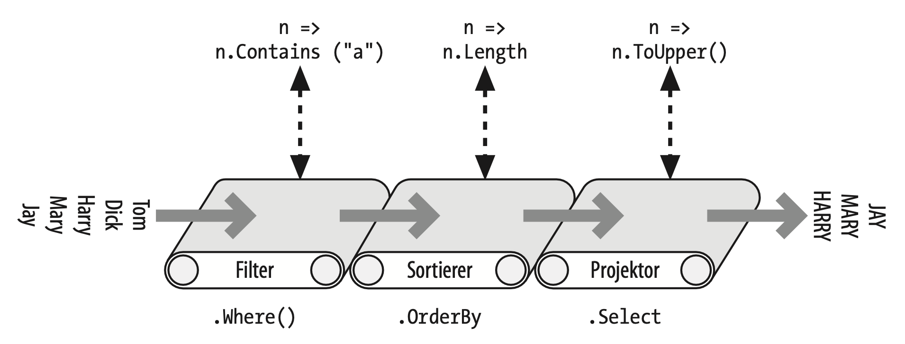
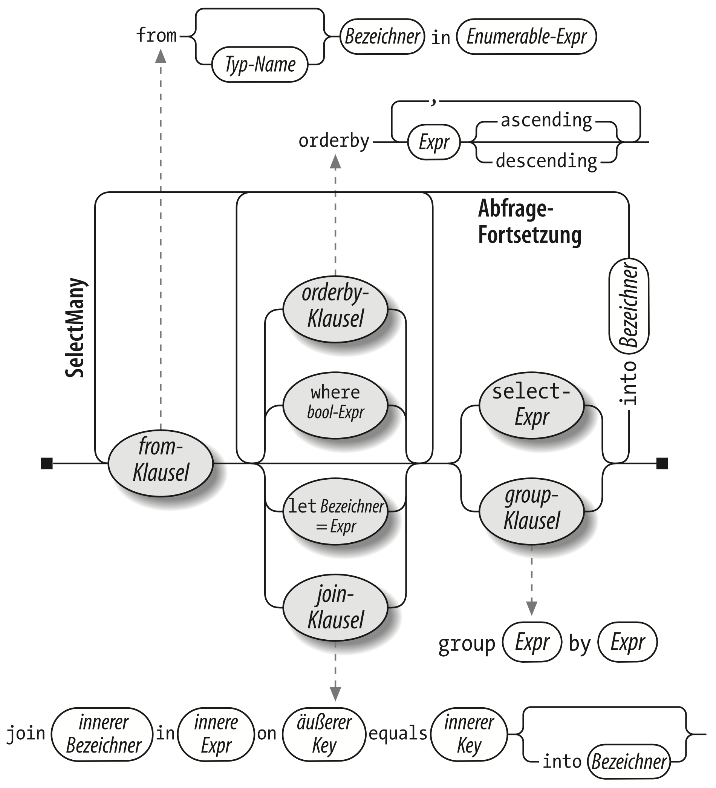

# LINQ


**LINQ** (**L**anguage **In**tegrated **Q**uery) ermöglicht eine strukturierte und typsichere Abfrage für lokale Objekt-Collections und Datenquellen auf anderen Rechnern zu schreiben.

LINQ kombiniert die Vorteile einer **Typprüfung** beim Kompilieren und einer **dynamischen Abfrageerzeugung**.


## Grundlagen von LINQ

Die grundlegenden Dateneinheiten in LINQ sind **Sequenzen** und **Elemente**.

Eine **Sequenz** ist ein beliebiges Objekt, das das generische Interface IEnumerable implementiert.

Ein **Element** ist jeder Teil innerhalb der **Sequenz**

```csharp
string[] names = { "Tom", "Dick", "Harry" };
```

Ein **Abfrageoperator** ist eine Methode, die eine **Sequenz** transformiert.


### Eine einfach Abfrage

Eine **Abfrage** ist ein Ausdruck, der **Sequenzen** mit einem oder mehreren **Abfrageoperatoren** transformiert.

```csharp
string[] names = { "Tom", "Dick", "Harry" };

IEnumerable<string> filteredNames = System.Linq.Enumerable.Where( names, n => n.Length >= 4);

foreach(string n in filteredNames)
    Console.Write(n + "|"); // Dick|Harry|
```

Da die Standard-Abfrageoperatoren als Erweiterungsmethoden implementiert sind, kann direkt auf `Where` in `names` zugegriffen werden.

```csharp
using System.Linq;

IEnumerable<string> filteredNames = names.Where(n => n.Length >= 4);
```


### Projizieren

Ein weiterer grundlegender **Abfrageoperator** ist die Methode `Select`. Diese transformiert jedes Element in der Eingabesequenz mit einem angegebenen Lambda-Ausdruck:

```csharp
string[] names = { "Tom", "Dick", "Harry" }; 

IEnumerable<string> upperNames = names.Select(n => n.ToUpper()); 

foreach(string n in upperNames)
    Console.Write(n + "|"); // TOM|DICK|HARRY|
```

Eine Abfrage kann auch in einen **anonymen Typ** projizieren:

```csharp
var query = names.Select (n => new {
    Name = n,
    Length = n.Length
});
```


### Take und Skip

Die Methoden `Take` und `Skip` ermöglichen das Auswählen von Elementen aus einer Sequenz.

```csharp
int[]numbers ={10,9,8,7,6}; 

IEnumerable<int> firstThree = numbers.Take(3);
IEnumerable<int> lastTwo = numbers.Skip(3);
```


### Elementoperatoren

Die Methoden `First`, `Last`, `Single` und `ElementAt` ermöglichen das Auswählen eines einzelnen Elements aus einer Sequenz.

```csharp
int[] numbers ={10,9,8,7,6};

int firstNumber = numbers.First();
int lastNumber = numbers.Last();
int secondNumber = numbers.ElementAt(2);
int firstOddNum = numbers.First(n => n%2 == 1);
```


### Aggregationsoperatoren

Die **Aggregationsoperatoren** liefern einen **skalaren Wert** zurück, im Allgemeinen einen numerischen. 

Die am häufigsten genutzten Aggregationsoperatoren sind `Count`, `Min`, `Max` und `Average`:

```csharp
int[] numbers = { 10, 9, 8, 7, 6 };
int count = numbers.Count();
int min = numbers.Min();
int max = numbers.Max();
double avg = numbers.Average();
```

Es kann ein optinales Prädikat übergeben werden, mit dem bestimmt wird, welche Elemente beachtet werden:

```csharp
int evenNums = numbers.Count(n => n%2 == 0);
```


### Quantifizierer

Die **Quantifizierer** liefern einen `bool`-Wert zurück. Quantifizierer sind `Contains`, `Any`, `All` und `SequenceEquals`:

```csharp
int[] numbers = { 10, 9, 8, 7, 6 };

bool hasTheNumberNine = numbers.Contains(9); 
bool hasMoreThanZeroElements = numbers.Any(); 
bool hasOddNum = numbers.Any(n => n % 2 == 1); 
bool allOddNums = numbers.All(n => n % 2 == 1)
```


### Set-Operatoren

Die **Set**-Operatoren erwarten zwei Eingabesequenzen vom gleichen Typ.

`Concat` hängt eine Sequenz an die andere an. `Union` tut das Gleiche, entfernt aber Duplikate:

```csharp
int[] seq1 = { 1, 2, 3 }, seq2 = { 3, 4, 5 };

IEnumerable<int> concat = seq1.Concat(seq2),
union = seq1.Union(seq2)
```


### Verzögerte Ausführung

Ein wichtiges Feature vieler Abfrageoperatoren ist, dass sie nicht beim Erstellen, sondern erst beim Enumerieren ausgeführt werden.

```csharp
var numbers = new List<int> { 1 };

IEnumerable<int> query = numbers.Select(n => n * 10);
numbers.Add(2);

foreach(int n in query)
    Console.Write (n + "|");
```

Alle Standard-Abfrageoperatoren arbeiten mit der verzögerten Ausführung, jedoch mit fol- genden Ausnahmen:

- Operatoren,die ein einzelnes Element oder einen skalaren Wert zurückgeben
- die Konvertierungsoperatoren `ToArray`, `ToList`, `ToDictionary`, `ToLookup` und `ToHashSet`


### Verkettung von Abfrageoperatoren




### Abfrageausdrücke

C# bietet außerdem eine spezielle Sprachunterstützung zum Schreiben von Abfragen, die den Titel **Abfrageausdrücke** trägt:

```csharp
IEnumerable<string> query = 
    from n in names
    where n.Contains("a") 
    orderby n.Length
    select n.ToUpper();
```

Ein **Abfrageausdruck** beginnt immer mit einer `from`-Klausel und endet entweder mit einer `select`- oder einer `group`-Klausel.





### Mehrere Generatoren

Eine Abfrage kann mehrere **Generatoren** (`from`-Klauseln) enthalten:

```csharp
int[] numbers = { 1, 2, 3 };
string[] letters = { "a", "b" };

IEnumerable<string> query = from n in numbers 
                            from l in letters
                            select n.ToString() + l;

// entspricht:

IEnumerable<string> query = numbers.SelectMany(n => letters,
    (n, l) => (n.ToString() + l));
```


### Verknüpfen

LINQ bietet drei **Verknüpfungsoperatoren**, von denen `Join` und `GroupJoin` am wichtigsten sind, die **schlüsselbasierte** Joins durchführen.

```csharp
var customers = new[] {
    new { ID = 1, Name = "Tom" }, 
    new { ID = 2, Name = "Dick" }, 
    new { ID = 3, Name = "Harry" }
};

var purchases = new[] {
    new { CustomerID = 1, Product = "Haus" }, 
    new { CustomerID = 2, Product = "Boot" }, 
    new { CustomerID = 2, Product = "Auto" }, 
    new { CustomerID = 3, Product = "Urlaub" }
};

IEnumerable<string> query = from c in customers 
                            join p in purchases on c.ID equals p. CustomerID
                            select c.Name + " hat gekauft: " + p.Product;

// entspricht:

IEnumerable<string> query = customers
    .Join(purchases, c => c.ID, p => p.CustomerID)
    .Select(p => p.Name + " hat gekauft: " + p.Product);
```


### GroupJoin

`GroupJoin` macht dasselbe wie `Join`, liefert aber keine flache Ergebnismenge zurück, sondern ein hierarchisches Ergebnis.

Die Syntax für GroupJoin ist die gleiche wie für `Join`, nur dass ihr das Schlüsselwort `into` folgt

```csharp
var query =
    from c in customers
    join p in purchases on c.ID equals p.CustomerID
    into custPurchases
    select custPurchases; 
```


### Zip

Zip ist der einfachste Verknüpfungsoperator. Er enumeriert zwei Sequenzen nebeneinander wie ein Reißverschluss:

```csharp
int[] numbers = { 3, 5, 7 };
string[] words = { "drei", "fünf", "sieben", "ignoriert" }; 

IEnumerable<string> zip = numbers.Zip(words, (n, w) => n + "=" + w);

//3=drei 
//5=fünf 
//7=sieben
```


### Ordnen

Das Schlüsselwort `orderby` sortiert eine Sequenz. Es können beliebige viele Ausdrücke angegeben werden, die die Sortierreihenfolge bestimmen.

```csharp
string[] names = { "Tom","Dick","Harry","Mary","Jay" };


IEnumerable<string> query = 
    from n in names 
    orderby n.Length, n
    select n;

// enspricht:

IEnumerable<string> query = 
    names.OrderBy(n => n.Length).ThenBy(n => n)
```


### Gruppieren

`GroupBy` arrangiert eine flache Eingabesequenz in Sequenzen aus Gruppen.

```csharp
string[] names = { "Tom","Dick","Harry","Mary","Jay" };

var query = from name in names 
            group name by name.Length;

// entspricht:

IEnumerable<IGrouping<int,string>> query = names.GroupBy(name => name.Length);
```


## 🏋️‍♀️ Übung

<a href="https://github.com/roeb/Training-C-Sharp/150-linq/" target="_blank">Patterns anwenden und LINQ lernen</a>