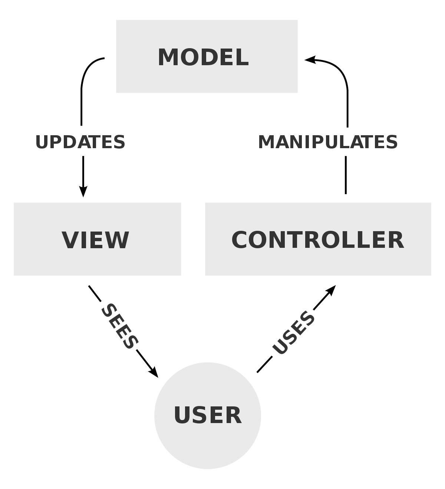
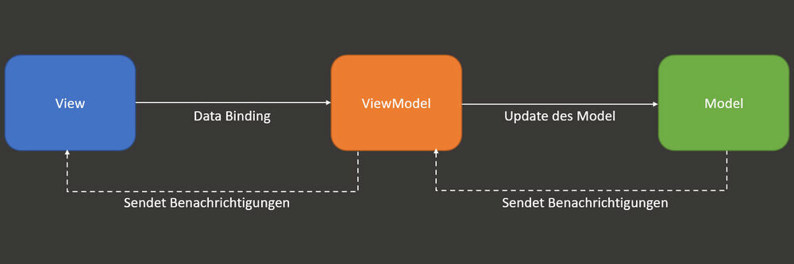

# Design Patterns für die Benutzeroberfläche

## Ziele

Klare Trennung von Logik und Darstellung

Bessere Testbarkeit und Wartbarkeit

Wiederverwendbarkeit sollte erhöht werden

**Fachliche Modellierung**: Fachliche Modellierung der anzuzeigenden Daten und Geschäftslogik.

**Präsentation**: Darstellung der Daten und Realisierung der Benutzerinteraktionen.

**Steuerung**: Navigation und Reaktion auf Benutzerinteraktionen.

### MVC

Das **Model-View-Controller** Pattern ist der Klassiker

Aufteilung der drei Klassen entspricht unmittelbar der Aufteilung in die drei Aufgabenbereiche.

**Controller** enthält die Logik zur Steuerung und hat direkte Abhängigkeiten zu View und Modell.

**View** ist hingegen abhängig vom Model. Sie kann Daten direkt aus dem Model lesen und darstellen.

**Model** repräsentiert die zugrunde liegende logische Struktur von Daten in einer Anwendung

### MVP

Das **Model-View-Presenter** Pattern basiert auf den Konzepten des MVC Patterns. 

Es gibt jedoch nur vor wie die Ansicht zu strukturieren ist.

**Model** hat die gleiche Aufgabe wie im MVC Pattern.

**View** ist passiv und stellt lediglich die Daten dar. Benutzerinteraktionen werden an den **Presenter** weitergeleitet.

**Presenter** ist die zentrale Komponente. Er enthält die Logik zur Steuerung und hat direkte Abhängigkeiten zu View und Modell.

### MVVM

Das **Model-View-ViewModel** Pattern basiert ebenfalls auf den Konzepten des MVC Patterns.

**Model** übernimmt Aufgaben bzgl. der Datenhaltung

**View** hat die grafische Darstellung der Oberfläche zur Aufgabe

**ViewModel** stellt die Verbindung zwischen View und Model her. Es enthält die Logik zur Steuerung und hat direkte Abhängigkeiten zu View und Modell.

## Technolgien

**SPA** (Single Page Application) ist eine Webanwendung, die auf einer einzigen HTML-Seite läuft und komplett im Browser ausgeführt wird.

**SSR** (Server Side Rendering) ist eine Technologie, die es ermöglicht, HTML-Seiten auf dem Server zu rendern und diese dann an den Client zu senden.

**WebAssembly** ist eine Technologie, die es ermöglicht, Code in einer Sprache zu schreiben, der dann in einer anderen Sprache kompiliert wird. Dieser Code kann dann in einer Webanwendung ausgeführt werden.

## Angular

Ein JavaScript-Framework für dynamische Webapplikationen

Für die Entwicklung von Single-Page-Apps gedacht

Basierend auf TypeScript

Entwickelt von Google

Eine MVC/MVVM-Framework, das bidirektionales Databinding unterstützt

## React

Ist eine JavaScript Bibliothek für die Entwicklung von Benutzeroberflächen

React Apps bestehen aus wiederverwendbaren Komponenten

React ist ebenfalls eine SPA

Einsatz eines virtuellen DOMs, was das reale DOM entlastet

## Blazor

Von Microsoft entwickeltes Framework für die Entwicklung von Webanwendungen. Entwickelt auf Basis von C# und .NET.

**Blazor Server** der Zustand der Anwendung wird Serverseitig verwaltet. Der Client kommuniziert mit dem Server über SignalR. Bottleneck bei vielen Nutzern.

**Blazor WebAssembly** führt die Anwendung (inkl. NET Runtime) komplett im Client aus. Der Client muss WebAssembly unterstützen. Kann offline ausgeführt werden.